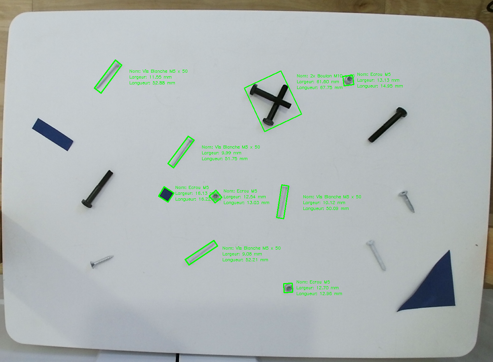

# SCREW DETECTION

Ce projet présente la mise en œuvre de différents algorithmes pour la détection de vis et d'écrous.



## Run Locally

Clone the project

```bash
  git clone https://github.com/GroverAruquipa/computer_vision_2024
```

Go to the project directory

```bash
  cd computer_vision_2024
```

Install dependencies

```bash
  npm requirements.txt
```
